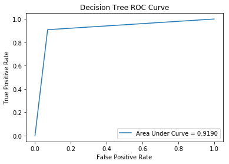

# SpamOrHam

## Spam Email Classification with Decision Trees in Python

# Table of Contents
* Abstract 
* Contributors
* Explanation of Data Wrangling Process
* Explanation of Data Analysis Process
* Brief Overview of Decision Trees

## Contributors
* Shon Inouye
* Ashriful Dulla
* Bryan Daetz 
* Kevin Wang
* Jun Ki Kwon (Peter)

## Abstract
This project focuses on the **classification** of emails as either spam or non-spam using **decision trees**. The [data set](https://archive.ics.uci.edu/ml/datasets/Spambase) for this project contains a list of spam and non-spam emails with their **attributes** in terms of frequency of certain words and characters. We used 75% of the data set to train the decision tree and applied that model on the remaining 25% of the data set to test the model accuracy. When training our decision tree, we focused on the importance of having minimal false positives as possible (good email marked as spam).

## Data Wrangling
In order match the values in the data set to their corresponding labels, we needed to create a list of column names. The names are given on the [data set description](https://archive.ics.uci.edu/ml/machine-learning-databases/spambase/spambase.names) for this project. We took these labels and set it as a list of columns in our script.

    columns = ['word_freq_make','word_freq_address','word_freq_all','word_freq_3d','word_freq_our','word_freq_over','word_freq_remove',
                'word_freq_internet','word_freq_order','word_freq_mail','word_freq_receive','word_freq_will','word_freq_people',
                'word_freq_report','word_freq_addresses','word_freq_free','word_freq_business','word_freq_email','word_freq_you',
                'word_freq_credit','word_freq_your','word_freq_font','word_freq_000','word_freq_money','word_freq_hp','word_freq_hpl',
                'word_freq_george','word_freq_650','word_freq_lab','word_freq_labs','word_freq_telnet','word_freq_857','word_freq_data',
                'word_freq_415','word_freq_85','word_freq_technology','word_freq_1999','word_freq_parts','word_freq_pm',
                'word_freq_direct','word_freq_cs','word_freq_meeting','word_freq_original','word_freq_project','word_freq_re',
                'word_freq_edu','word_freq_table','word_freq_conference','char_freq_;','char_freq_(','char_freq_[','char_freq_!',
                'char_freq_$','char_freq_#','capital_run_length_average','capital_run_length_longest','capital_run_length_total']
## Data Analysis
We found the 10 most important predictors for our Decision Tree Classifier algorithm.  It seems that the most important predictor by far is the use of excalamation marks.

| Predictor | Importance |
|------------|------------|
|char_freq_! | 0.334817369007 |
| word_freq_over | 0.159363276944 |
| char_freq_[ | 0.0890565948252 |
| word_freq_money | 0.055601149615 |
| capital_run_length_longest | 0.0418640694781 |
| word_freq_addresses | 0.0336232868801 |
| capital_run_length_average | 0.0288015387955 |
| char_freq_# | 0.0261924346351 |
| word_freq_hpl | 0.0260389190479 |
|word_freq_3d | 0.0238941385947 |

Here are the accuracy and error rate of our algorithm on the test set we created:
   * Accuracy: 0.920938314509
   * Error Rate: 0.0790616854909

Here is the breakdown of our correct and incorrect classifications from the test set:
    
|                  | Was Not Spam | Was Spam |
|------------------|--------------|----------|
|Predicted Not Spam | 633 | 48 |
|Predicted Spam | 43 | 427 |
    
 

## Overview of Decision Trees

